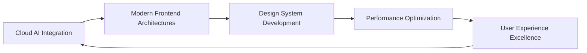

# ✦ Aeyla Naseer ✦ Digital Architect & Frontend Artisan

<div align="center">
  
  <!-- Metallic Banner -->
  
  
  <!-- Sophisticated Title Animation -->
  
  
  <!-- Elegant Status Badges -->
  <p>
    
    
    
  </p>

</div>

---

<table width="100%">
<tr>
<td width="60%" valign="top">

## ⚡ Profile Overview

```yaml
developer:
  name: "Aeyla Naseer"
  role: "Frontend Developer & UI/UX Architect"
  location: "Digital Realm"
  experience: "Crafting Exceptional User Experiences"
  
current_focus:
  - Cloud-Applied Generative AI
  - Modern Frontend Architectures
  - Responsive Design Systems
  - User-Centric Development
  
philosophy: |
    "Excellence is not a skill, it's an attitude.
     Every line of code is a brushstroke in the
     masterpiece of digital experience."
  
work_style:
  environment: "Lo-fi beats + Clean workspace"
  tools: "Modern stack + Creative vision"
  approach: "User-first, performance-optimized"
```

### 🎯 Core Competencies

<div align="left">

**Frontend Mastery**
- Modern JavaScript/TypeScript ecosystems
- React/Next.js application development
- Responsive & mobile-first design
- Performance optimization & accessibility

**Design & User Experience**
- UI/UX design principles
- Design system architecture
- Prototyping & user research
- Visual hierarchy & typography

**Emerging Technologies**
- Cloud-integrated AI solutions
- Modern deployment strategies
- API design & integration
- Progressive web applications

</div>

</td>
<td width="40%" valign="top">


### 📊 Development Analytics

<div align="center">


</div>

### 🔗 Professional Network

<div align="center">

[](https://linkedin.com/in/aeyla%20naseer)

[](https://discord.gg/user6790.h)

[](mailto:user6790.h@example.com)

</div>

</td>
</tr>
</table>

---

## 🛠️ Technology Arsenal

<div align="center">

### Frontend Development


### Backend & Data


### Design & Tools


### Cloud & AI


</div>

---

## 🎨 Featured Projects

<table width="100%">
<tr>
<th width="30%">Project</th>
<th width="40%">Description</th>
<th width="30%">Technology Stack</th>
</tr>
<tr>
<td align="center">
<strong>🎯 NeonCV Builder</strong><br>

</td>
<td>
Dynamic CV generation platform with real-time preview and export capabilities. Features animated components and modern design patterns.
</td>
<td align="center">
<code>TypeScript</code><br>
<code>React</code><br>
<code>CSS Animations</code>
</td>
</tr>
<tr>
<td align="center">
<strong>👗 Fashion Nightmare</strong><br>

</td>
<td>
Immersive horror-fashion experience in Roblox, combining interactive storytelling with modern game design principles.
</td>
<td align="center">
<code>Roblox Studio</code><br>
<code>Lua</code><br>
<code>3D Design</code>
</td>
</tr>
<tr>
<td align="center">
<strong>🤖 Health AI Agent</strong><br>

</td>
<td>
Intelligent wellness advisor powered by machine learning, providing personalized health recommendations and insights.
</td>
<td align="center">
<code>Python</code><br>
<code>OpenAI API</code><br>
<code>FastAPI</code>
</td>
</tr>
</table>

---

## 📈 GitHub Activity Overview

<div align="center">
  
</div>

---

## 💭 Development Philosophy

<div align="center">

> *"The best code is not just functional—it's elegant, maintainable, and tells a story. Every project is an opportunity to push the boundaries of what's possible in digital experiences."*

<table>
<tr>
<td align="center" width="33%">
<h4>🎨 Design-First Approach</h4>
User experience drives every technical decision
</td>
<td align="center" width="33%">
<h4>⚡ Performance Obsessed</h4>
Optimization is not optional—it's essential
</td>
<td align="center" width="33%">
<h4>🔬 Continuous Learning</h4>
Technology evolves, and so do I
</td>
</tr>
</table>

</div>

---

## 🎯 Current Objectives



### 2024 Focus Areas
- **🌩️ Cloud-Applied Generative AI** - Exploring the intersection of AI and user interfaces
- **🏗️ Scalable Architecture** - Building systems that grow with user needs
- **🎨 Design Systems** - Creating cohesive, reusable component libraries
- **📱 Mobile-First Development** - Responsive, accessible experiences across all devices

---

<div align="center">

## ✨ Let's Build Something Amazing Together


---

<p>


</p>

**✦ Crafted with precision, passion, and countless cups of coffee ✦**

<sub>Last updated: 2024 | Built with ❤️ for the dev community</sub>

</div>

